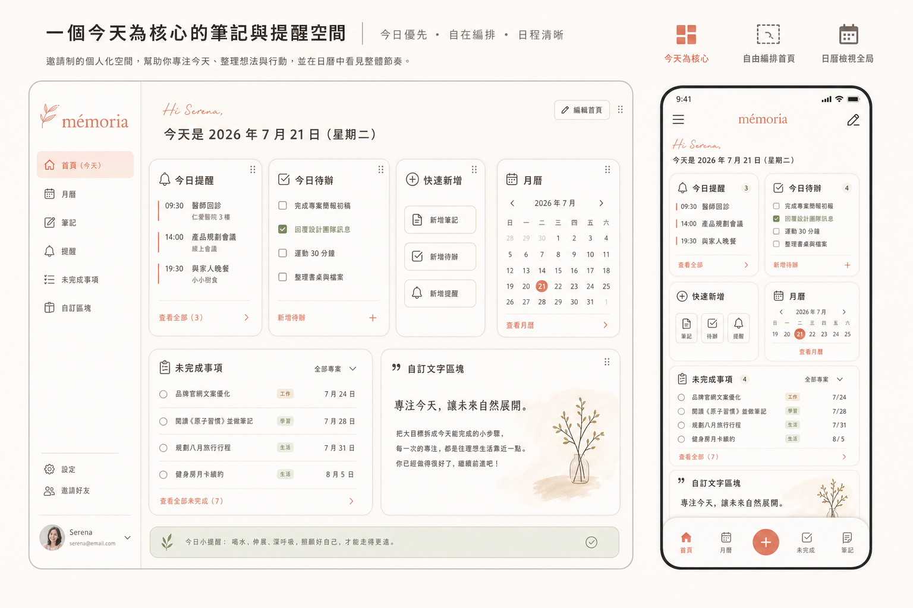

# 個人記事本與提醒工作區｜產品設計基準

> 版本：v1.0 設計基準
> 更新日期：2026-07-21
> 狀態：高保真概念確認，尚未視為最終實作規格

這份文件是後續設計與開發的比較基準。若程式畫面與本文件不一致，先確認是需求變更、版面限制或實作偏差，再決定是否更新文件；不要讓文件與程式默默分叉。

## 1. 產品定位

這是一個給少數受邀使用者的私人個人工作區，用來集中管理：

- 今天要完成的待辦事項
- 一次性與週期性提醒
- 可自由編輯的記事與日誌
- 月曆、標籤、資料夾與搜尋
- 使用者可自己調整的首頁工作區
- 頭像、背景與色彩風格

核心感受是「安靜、溫暖、可掌控」。產品應該幫使用者把生活中的事情放下來、看清楚、再逐項處理，而不是製造壓力或像戰情中心一樣催促使用者。

第一版是邀請制。Admin 由後台建立會員的初始帳號與密碼；使用者首次登入後應被引導修改密碼。忘記帳密時由 Admin 協助重設。第一版不使用 Email 流程，通知也以站內通知與瀏覽器通知為主，是否允許瀏覽器通知交給使用者選擇。

## 2. 已確認的產品決策

### 帳號與權限

- 登入方式：帳號／密碼。
- 會員建立：只允許 Admin 建立。
- 首次登入：強制修改初始密碼。
- 忘記密碼：由 Admin 重設，不建置 Email 找回流程。
- 一般使用者：只能看與修改自己的內容。
- Admin：管理會員、新增會員、修改會員資料、停用／啟用會員、重設密碼；第一版不預設能查看會員私人內容。

### 內容模型

- 筆記：支援純文字、標題、清單、連結、圖片上傳與貼上圖片。
- 待辦：標題、內容、到期日期／時間、優先級、標籤、資料夾、完成狀態。
- 提醒：一次性、每日、每週、每月、自訂週期。
- 週期提醒：完成後自動停止；若未完成則保留並呈現逾期狀態。
- 標籤：使用者可自行建立、修改、刪除；刪除前需顯示影響說明與二次確認。
- 資料夾：用於較大分類；標籤用於跨分類的細部標記。
- 搜尋：第一版至少支援標題與內容關鍵字，後續再加入日期、標籤、類型篩選。
- 刪除：先說明刪除後的影響，再進行二次確認；封存不作為第一版獨立狀態，使用者確認後直接刪除。

### 首頁工作區

首頁預設提供以下組件：

1. 今日提醒
2. 今日待辦
3. 快速新增
4. 月曆
5. 未完成事項
6. 自訂文字區塊

桌面版可以拖曳組件、調整大小、隱藏組件；大小受最小／最大欄位限制，避免破壞版面。提供「重設首頁配置」操作。手機版採單欄堆疊，可調整順序與隱藏，但不使用自由拖曳縮放，以維持觸控與可讀性。

### 個人化

- 頭像：預設頭像、上傳圖片、裁切與替換。
- 背景：上傳圖片、裁切、模糊與遮罩強度調整。
- 第一版背景為全站背景，不做每一頁不同背景。
- 風格：第一版提供亮色／暗色與色彩配色調整；完整主題套件可在後續版本加入。
- 個人化設定要即時預覽，並提供恢復預設值。

## 3. 導覽與頁面地圖

### 一般使用者

- 登入
- 首次修改密碼
- 首頁 Dashboard
- 快速新增
- 筆記列表
- 筆記編輯／檢視
- 待辦與提醒列表
- 待辦／提醒新增與編輯
- 月曆
- 標籤管理
- 站內通知
- 個人設定與外觀設定

### Admin

- 會員列表
- 新增會員
- 編輯會員資料
- 停用／啟用會員
- 重設會員密碼

### 所有頁面應考慮的狀態

- 初次使用的空狀態
- 載入中
- 儲存成功
- 儲存失敗與重試
- 無權限
- 登入逾時
- 逾期提醒
- 刪除說明與二次確認
- 瀏覽器通知權限提示
- 圖片上傳失敗、檔案過大或格式不支援

## 4. 首頁版面基準

### 桌面版

- 參考畫布：1440 × 1024。
- 左側固定導覽列；內容區採寬鬆留白。
- 使用 12 欄網格，組件只能在網格內移動與調整。
- 預設以「今天」為主軸：今日提醒與今日待辦優先顯示。
- 月曆與未完成事項作為次要資訊；自訂文字區塊可放在使用者最需要的位置。
- 編輯首頁配置時，顯示清楚的拖曳、縮放與隱藏狀態。

### 手機版

- 參考畫布：390 × 844。
- 內容單欄堆疊，卡片不互相覆蓋。
- 底部導覽列取代桌面側欄。
- 快速新增保留為容易觸及的主要操作。
- 卡片內的文字、按鈕與勾選框需保留足夠的觸控尺寸。
- 月曆在小螢幕先顯示日期狀態與事件數，點擊後再看當日清單。

### 頁面之間的混合方向

- Dashboard：採 Today-first，先處理今天。
- Dashboard 編輯模式：採可調整的 widget grid。
- Calendar：採月曆搭配當日 agenda，避免只有月格而找不到實際事項。

## 5. 視覺設計基準

### 色彩

| 用途 | Token | 色值 |
| --- | --- | --- |
| 主背景 | `surface-base` | `#FFF9F4` |
| 主要文字 | `text-primary` | `#2E2A28` |
| 次要文字 | `text-muted` | `#776E68` |
| 主色／主要操作 | `accent-terracotta` | `#E98A7A` |
| 深色主色 | `accent-terracotta-strong` | `#C96B61` |
| 輔助色 | `accent-sage` | `#A9B9A3` |
| 淡色區塊 | `surface-soft` | `#F3ECE5` |
| 危險／逾期 | `status-danger` | `#C95F58` |
| 成功／完成 | `status-success` | `#6F9071` |

### 字體與圖示

- 內文使用圓潤、清楚的無襯線字體；建議 Quicksand 或同類型字體。
- 手寫感只用於歡迎語、空狀態或少量裝飾，不用在表單、日期、按鈕與錯誤訊息。
- 圖示使用一致的 Lucide-style 線性圖示。
- 不使用 emoji 作為主要功能圖示，以免在不同裝置呈現不一致。
- 色彩與文字需保持可讀對比；裝飾不能取代文字標籤。

### 元件語言

- 卡片使用柔和圓角、細邊框與非常輕的陰影。
- 可使用低強度玻璃感，但不可讓文字與控制項失去對比。
- 主按鈕採溫暖珊瑚色；次要操作使用低對比底色或文字按鈕。
- 裝飾以植物、紙張與柔和幾何形狀為主。
- 避免沿用舊版的霓虹、全息、像素、軍事／戰術、武士或 CRT/HUD 語彙。

## 6. 高保真參考圖

這張圖是目前「首頁」的高保真混合方向：桌面版側欄、Today-first widget、手機版底部導覽與相同內容層級。圖中的 `mémoria` 與 `Serena` 是概念用暫名，尚未定案。

圖中可保留的方向：

- 溫暖米白背景與珊瑚主色。
- 首頁以問候語與今日內容建立焦點。
- 卡片之間留白清楚，資訊以小區塊分組。
- 桌面與手機使用同一套視覺語言，只改變導覽與排列方式。

需要在正式實作前再確認的方向：

- 最終產品名稱與 Logo。
- 玻璃感的強弱與背景圖對文字對比的影響。
- 小螢幕首頁的卡片排序與快速新增入口位置。
- 圖片型裝飾是否只在空狀態／登入頁使用，避免干擾日常工作。

## 7. 素材清單

目前素材放在 `public/image/illustrations/`，使用前景透明 PNG，生成時的綠幕來源檔不納入產品使用路徑。

| 素材 | 用途 | 路徑 |
| --- | --- | --- |
| Botanical sprig | 登入頁、空狀態或自訂文字區塊裝飾 | `/image/illustrations/botanical-sprig.png` |
| Paper note | 筆記空狀態、快速新增或 onboarding 裝飾 | `/image/illustrations/paper-note.png` |
| Soft abstract shape | 卡片角落、背景裝飾或外觀預覽 | `/image/illustrations/soft-abstract-shape.png` |

生成插畫目前採 PNG，是因為圖像生成結果以點陣圖輸出；功能圖示與介面 icon 仍應使用 SVG／Lucide。若後續需要無限縮放的品牌插畫，再針對已確認的素材製作正式 SVG 版本。

## 8. 實作驗收檢查表

- [ ] 桌面版與手機版不互相覆蓋，沒有水平捲軸。
- [ ] 首頁組件可在限制內拖曳、縮放、隱藏與重設。
- [ ] 手機版使用單欄與底部導覽，主要操作可單手觸及。
- [ ] 今日提醒、今日待辦、快速新增、月曆、未完成事項、自訂文字區塊皆可使用。
- [ ] 提醒週期包含一次性、每日、每週、每月、自訂，完成後停止。
- [ ] 刪除流程有影響說明與二次確認。
- [ ] 標籤可以由使用者建立、修改與刪除。
- [ ] 頭像、背景、色彩與亮／暗色設定可儲存並跨裝置同步。
- [ ] 未授權使用者不能進入會員管理或其他使用者內容。
- [ ] 空狀態、錯誤、逾期、通知權限與圖片上傳失敗都有明確回饋。

## 9. 版本紀錄

### v1.0 — 2026-07-21

- 建立個人記事本與提醒工作區的產品定位與 MVP 邊界。
- 固化邀請制、Admin 帳號管理、無 Email 流程等決策。
- 固化首頁組件、桌面／手機響應式策略與個人化方向。
- 收錄目前高保真首頁參考圖與透明背景插畫素材。

